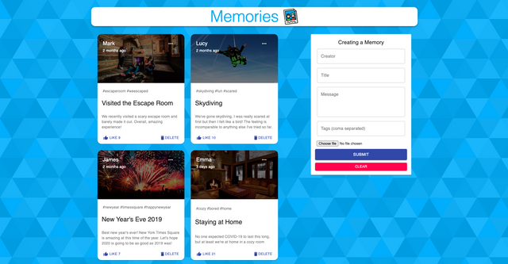

# Memories Social Media App

## **Description**

_Memories is a simple social media app that allows users to post interesting events that happened in their lives. Users can create an account, log in, and share their stories with a community of like-minded individuals. The app has been developed using ReactJS for the frontend, NodeJS for the backend, and MongoDB as the database._

## **Features**

- **User Authentication:** The app requires users to create an account and log in to access the features. Users can reset their passwords or update their profile information as needed.
- **Post Creation:** Users can create a new post with a title, description, image, and tags. Posts can be edited or deleted as needed. The tags help to categorize posts and make them easier to find.
- **Interaction between Users:** Users can like, comment, and share each other's posts, providing a way to interact and engage with the content. Notifications are sent via email when there is activity on a user's post.
- **Search Functionality:** Users can search for posts based on keywords, tags, or other criteria. The search feature helps to find relevant content quickly and easily.
- **User-friendly Interface:** The app has been designed with a user-friendly interface that is easy to navigate. The posts are displayed in a feed-like format, and users can filter the posts based on tags or other criteria.

## **Technologies Used**

- **ReactJS:** A JavaScript library for building user interfaces.
  NodeJS: A JavaScript runtime for building scalable and efficient applications.

- **MongoDB:** A NoSQL database for storing and retrieving data.

## **Installation**

_To run the app locally, follow these steps:_

1. **Clone the repository**

2. Install dependencies with npm install
3. Start the app with npm start

   ## **Contributors**

> **VAIBHAV KUMAR**

## **License**

> This project is licensed under the MIT License.
